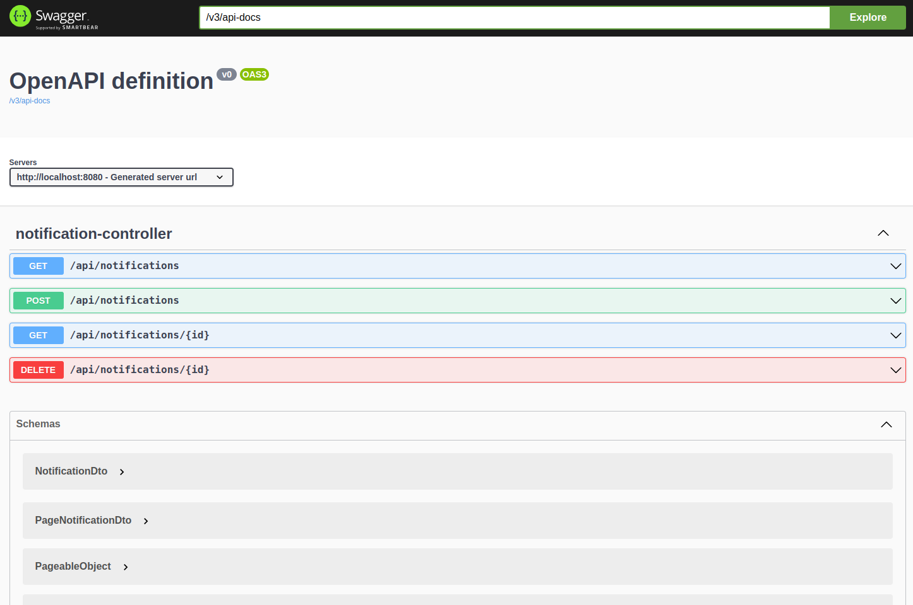

# Sample Reactive CRUD Application

Welcome to the Reactive Notification CRUD application! This project leverages reactive programming 
to facilitate CRUD operations for notifications.
## Key Features:
* **Searching and Pagination in Reactive Repository**: Efficiently query and paginate through 
notifications using the power of reactive repositories.
* **Error Handling in Webflux**: Experience robust error handling mechanisms implemented within the 
Webflux framework for a resilient application.
* **Liquibase in Webflux**: Utilize Liquibase to seamlessly manage database schema and tables within the 
reactive programming paradigm.
## Technologies Used:
* Java 21
* Webflux
* R2DBC
## How To Run?
**Docker** will start **Postgresql** container and **Liquibase** will create db schema and
tables. You should just build application:
```sh
$ ./gradlew bootRun
```
## How To Use?
Now you can go to [Swagger Url](http://localhost:8080/swagger-ui/index.html#/) and run APIs.
  

Create notification request Curl example:
```sh
curl -X 'POST' \
'http://localhost:8080/api/notifications' \
-H 'accept: */*' \
-H 'Content-Type: application/json' \
-d '{
"content": "testContent"
}'
```